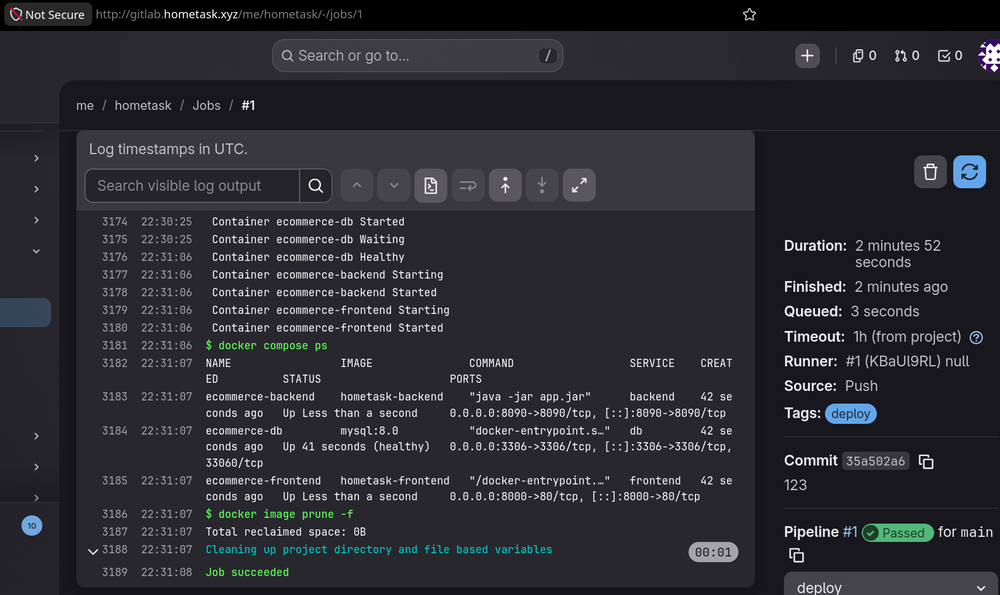

# Hometask

- Host environment: Generic Linux
- Tested VM: Ubuntu 24.04
- The Ansible host values must be defined in `ansible/host_vars/us2604.yml`

To create the GitLab environment:

```bash
./create_gitlab.sh
```

To clean up the environment for GitLab deployment:

```bash
./clean_up.sh
```

The output will show the default root and user passwords, as well as the
hostname.

Then Ansible can be run with:

```bash
ansible-playbook site.yml
```

You then move the contents of `./full-stack-ecommerce-project/` to the cloned
local gitlab repository `./hometask/`, commit all changes and push, thus
triggerring the pipeline:

```bash
cp -r ./full-stack-ecommerce-project/* ./hometask/
cd ./hometask/
git add .
git commit -m "initial commit"
git push
```

You should now see the job running on GitLab:


