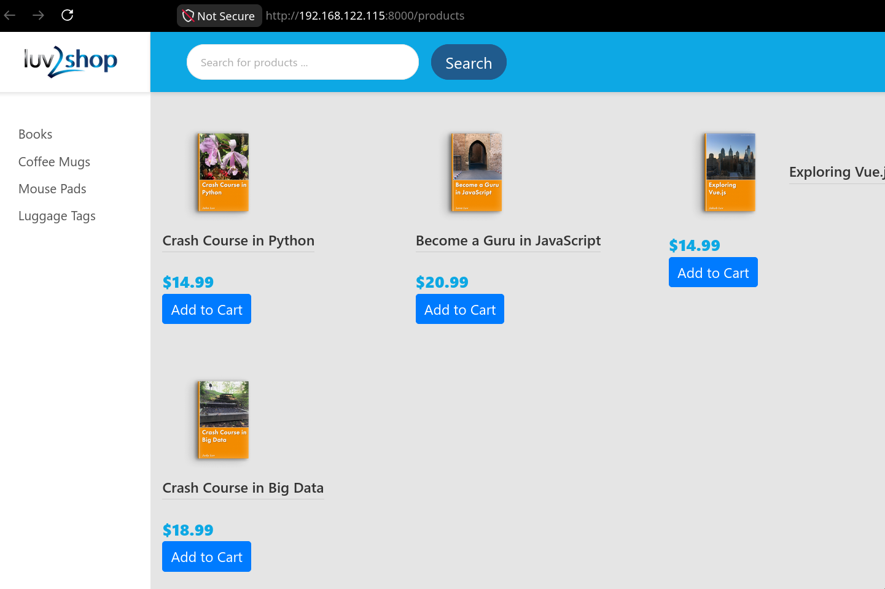

# Hometask

- Host environment: Generic Linux
- Tested VM: Ubuntu 24.04
- The Ansible host values must be defined in `ansible/host_vars/us2404.yml`
- passwordless sudo user is assumed to be configured on the VM

To create the GitLab environment:

```bash
bash ./create_gitlab.sh
```

The output will show the default root and user passwords, as well as the
hostname.

To clean up the environment for GitLab deployment (**DESTRUCTIVE**):

```bash
bash ./clean_up.sh
```

Then run Ansible:

```bash
cd ansible/
ansible-playbook site.yml
cd ..
```

Now you have to move the contents of `./full-stack-ecommerce-project/` to the
locally cloned GitLab repository `./hometask/`, commit all changes and push,
thus triggerring the pipeline:

```bash
cp -r ./full-stack-ecommerce-project/* ./hometask/
cd ./hometask/
git add .
git commit -m "initial commit"
git push
```

You should now see the job running on GitLab:


CI/CD-provisioned application works:


